# Predict Defective Commits Just-In-Time

## Introduction

Le développement logiciel moderne, particulièrement en environnement collaboratif, est caractérisé par des changements fréquents et rapides du code source. Chaque modification (ou commit) introduite dans le code peut potentiellement provoquer des erreurs ou des régressions, compromettant la stabilité et la fiabilité du logiciel. Pour répondre à ce défi, ce projet propose de développer une intelligence artificielle prédictive capable de déterminer l'impact d'un commit sur le reste du code et d'estimer la probabilité de régression.

L'objectif de cette étude est d'examiner les approches existantes pour la prédiction des commits défectueux et de proposer une solution innovante qui s'appuie sur les techniques avancées de machine learning et de deep learning. Cette solution permettra d'identifier proactivement les commits susceptibles de causer des problèmes, offrant ainsi aux développeurs des outils pour améliorer la qualité du code et réduire les coûts associés aux erreurs et aux régressions.

## Predict Defective Commits Just-In-Time

### A. Logistic Regression

### B. Deeper: Feature selection phase + Classification phase

### Just-In-Time defective prediction

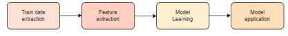

1. Label commits as buggy or not according to history.
2. Extract from each commit its features’ values.
3. The labeled commits + corresponding features are fed to classification algorithm.
4. New commit ⇒ Feature values extraction ⇒ fed to the learned model ⇒ Buggy / Not.

### A. Logistic Regression Cons

- Cannot create combined features.
- Selection of only input features that are linear to output labels.
  - Bad training performance / training failure.

⇒ Here comes Deeper🎉

### B. Deeper’s Pros

- Generation of more expressive feature set from initial one. ⇒ More efficient and precise in expressing the nature of a problem.
- It can create combined features.

Deeper = DL + ML ⇒ Predict if commits are defected or not.

1. Feature selection: Select from commit features the most expressive features using Deep Belief Network Algorithm.
2. ML: Selected features are fed to ML predictive classifier.

- For evaluation, we used datasets from six large open source projects, i.e., Bugzilla, Columba, JDT, Platform, Mozilla, and PostgreSQL, containing a total of 137,417 commits.
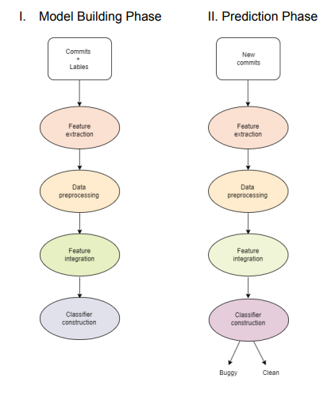
## Evaluation

| Approach        | Discovered Bugs | F1-Score  |
|-----------------|-----------------|-----------|
| Kamei et al (LR)| 18.82%          | 0.22-0.63 |
| Deeper          | 51.04%          |           |

The comparison of the approach with the approach proposed by Kamei et al. showed that on average across the 6 projects, Deeper could discover 32.22% more bugs than Kamei et al’s approach (51.04% versus 18.82% on average). In addition, Deeper can achieve F1 scores of 0.22-0.63, which are statistically significantly higher than those of Kamei et al.’s approach on 4 out of the 6 projects.

### Cons

The approach does not leverage the true notions of deep learning as they still employ the same set of features that are manually engineered as in previous work, and their model is not end-to-end trainable.

## Graph-based Machine Learning Improves Just-In-Time Defect Prediction

### Proposed Method

The research introduces a novel framework for Just-In-Time (JIT) defect prediction by utilizing graph-based machine learning (ML) on contribution graphs. These graphs represent the interactions between developers and source code files, aiming to improve the prediction of defect-prone changes in software development.

The purpose of this research is to improve the accuracy of predicting defect-prone code changes by leveraging graph-based ML techniques. The hypothesis is that features extracted from contribution graphs provide better predictive power than traditional software characteristic features.

### Phases

The method is composed of three main phases: dataset generation, training, and testing.

1. In the dataset generation phase, building a labeled commit dataset by combining the extracted graph features from the contribution graph and bug-inducing commits produced by the SZZ algorithm.
2. During the training phase, processing the training data by conducting data preparation, model training, and selection on a subset of classifiers.
3. During the testing phase, preparing the data from given code commits and feeding it into the trained model. Predictions from the classifiers are used to estimate the quality of the predictions.
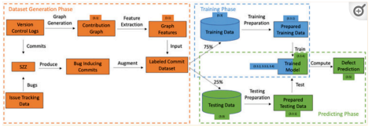

### Performance Metrics

The performance of the proposed approach is measured using:

- **F1 Score**: The best model achieved an F1 score of 77.55%, which is 152% higher than the state-of-the-art.
- **Matthews Correlation Coefficient (MCC)**: The best model achieved an MCC of 53.16%, which is 3% higher than the state-of-the-art.

### Contributions

- **Graph-Based ML for JIT Defect Prediction**: This study introduces the use of graph-based ML techniques for JIT defect prediction, specifically through contribution graphs that model developer interactions with source files.
- **Edge Classification Framework**: The approach frames JIT defect prediction as an edge classification problem, assigning probability scores to new code changes to predict defect likelihood.
- **Feature Extraction and Evaluation**: Features are extracted from contribution graphs using centrality metrics and community assignments/node embeddings. These features are then used to inform ML models for classifying defect-prone changes.
- **Empirical Validation**: The research evaluates the graph-based ML models on 14 open-source projects, demonstrating significant improvements over traditional JIT defect prediction methods in terms of F1 score and MCC.

ML Models used: Logistic regression, Random forest, XG Boost

## Predicting Technical Debt from Commit Contents: Reproduction and Extension with Automated Feature Selection

### A. Study of Yan et al
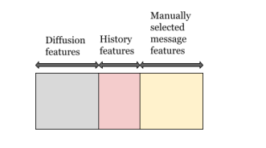
### B. Extending the study of ‘Yan et al’ by replacing their manually chosen features with automated feature selection
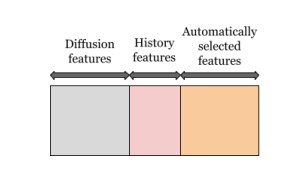
https://link.springer.com/article/10.1007/s11219-020-09520-3
https://link.springer.com/article/10.1007/s11219-020-09520-3
https://link.springer.com/article/10.1007/s11219-020-09520-3

### Methodology
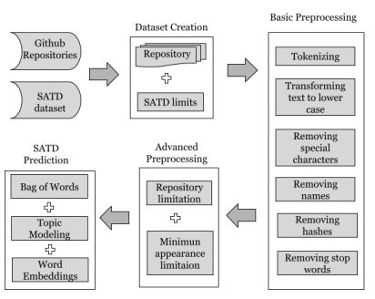
#### Step 1: Dataset creation

The dataset was created by collecting data from five open-source GitHub repositories and merging it with an existing dataset.

#### Step 2: Basic preprocessing

Basic preprocessing was applied to commit messages, including converting to lower case, removing hashes, stop words, developer names, special characters, and tokenizing the text to prepare it for analysis.

#### Step 3: Advanced preprocessing

Advanced preprocessing was conducted to improve word generalizability by imposing constraints on word appearances across repositories and using percentage thresholds to exclude rare and project-specific terms.

#### Step 4: Different NLP techniques, machine learning classifier, and statistical methods

Three NLP techniques were compared for SATD prediction accuracy using logistic regression, alongside a description of the machine learning classifier and statistical methods used for evaluating the results.

1. **NLP technique 1: Bag-of-words**: Represents each commit message as a collection of words and their frequencies, ignoring word order.
2. **NLP technique 2: Topic discovery**: Used to find topics within commit messages.
3. **NLP technique 3: Word embeddings**: Represents words as semantic vectors, allowing for the identification of similarities between words.
4. **Machine learning classifier**: A binomial logistic regression with lasso penalty is used for classification.
5. **Statistical analysis**: Statistical analysis is conducted to validate the results and determine the significance of predictor words in identifying SATD.

### Results

#### Comparison of three NLP techniques

| Model Name        | Median AUC |
|-------------------|-------------|
| Bag of Words      | 0.7411      |
| Word Embeddings   | 0.6631      |
| Topic Modeling    | 0.6294      |

- The Bag-of-words outperforms the other two techniques with a median AUC of 0.7411.

#### The performance of Yan et al.'s model compared to the new model with automatic selection of features
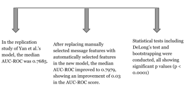
- Accepting the alternative hypothesis that automatically selected features improve performance over manually selected ones.

## Utilisation de l'historique de Validation Git pour la modification prédiction

### But du projet

- Enquêter et évaluer l'utilité de l'utilisation de l'historiques de modifications
- Prédire et suggérer les fichiers susceptibles d’être modifiés ensemble
- Se concentrer sur Git ⇒ déterminer les avantages des contrôles des versions
gestion automatique des historiques et la résolution des erreurs
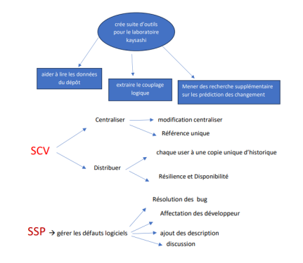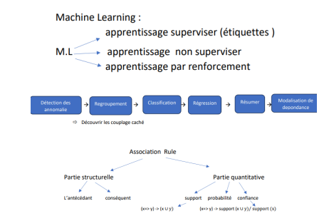
### Rule Learning

- Trouver les ensembles des éléments fréquents
- Calculer les règles d'association

### Utiliser Java

- **JGit**: Lire les données des dépôts git
- **R**: Bibliothèque des règles d’association

### Parcours commit par commit

- Traiter les changements et les stocker dans une structure de données, ensuite appliquer R et ouvrir les feedbacks.
  - (+) Évaluation des performances générales de prédiction
  - (+) Suivi automatique des renommages et analyse des commits de correction de bogues

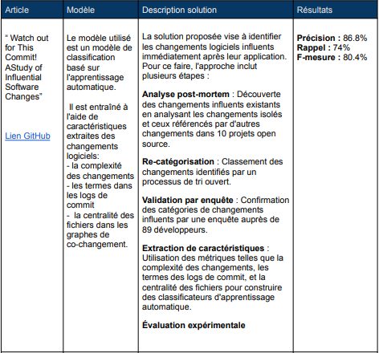

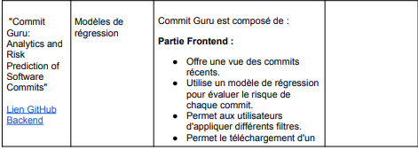

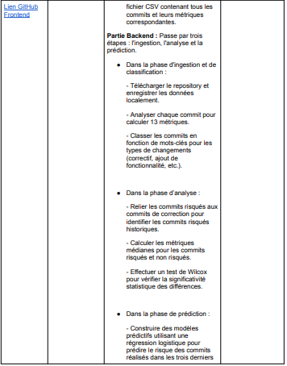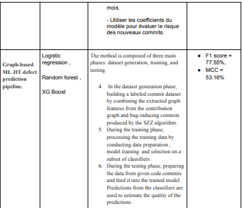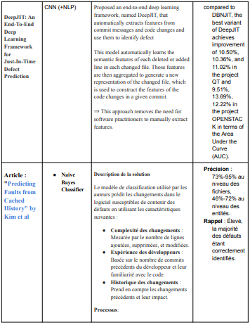
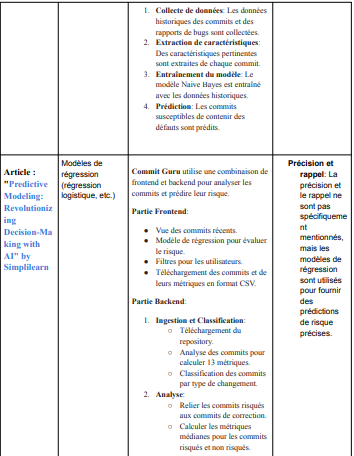
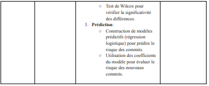
## Articles

# Article 1: "Predicting Faults from Cached History" by Kim et al.

Ce article explore des modèles prédictifs pour anticiper les défauts logiciels en utilisant des données historiques. Voici une analyse :

## Modèles Utilisés

### Change Classification Model
Les auteurs utilisent un modèle de classification pour prédire les changements susceptibles de contenir des défauts dans le logiciel. Ce modèle utilise des caractéristiques telles que la complexité des changements, l'expérience des développeurs et l'historique des changements.

- **Naive Bayes Classifier** : Plus précisément, ils utilisent un classificateur Naive Bayes pour traiter ces caractéristiques et prédire la probabilité de défauts dans les nouveaux changements.

## Avantages

- **Rappel Élevé** : Le modèle démontre un rappel élevé, ce qui signifie qu'il identifie efficacement la plupart des changements susceptibles de contenir des défauts, ce qui est crucial dans la maintenance logicielle.
- **Utilisation des Données Historiques** : En utilisant l'historique mis en cache, le modèle peut faire des prédictions informées basées sur des schémas passés, améliorant ainsi la précision au fil du temps.

## Inconvénients

- **Compromis sur la Précision** : Bien que le rappel soit élevé, la précision est plus faible, entraînant de nombreux faux positifs. Cela signifie que bien que la plupart des défauts soient capturés, de nombreux changements non défectueux sont également signalés, ce qui peut être inefficace.
- **Dépendance aux Données Historiques** : L'efficacité du modèle repose fortement sur la disponibilité et la qualité des données historiques. Dans les projets avec un historique rare ou bruité, la précision du modèle peut diminuer.

# Article 2: "Predictive Modeling: Revolutionizing Decision-Making with AI" by Simplilearn

Cet article fournit un aperçu de diverses techniques de modélisation prédictive et de leurs applications, en se concentrant sur des cas d'utilisation commerciale et technique, qui peuvent être analogiquement appliqués à l'ingénierie logicielle.

## Modèles Utilisés

- **Regression Models** : Utilisés pour prédire des résultats numériques basés sur des données historiques. Des exemples incluent la régression linéaire et logistique.
- **Neural Networks** : Particulièrement utiles pour capturer des schémas complexes dans de grands ensembles de données, les réseaux neuronaux tels que les CNN et RNN peuvent être utilisés pour prédire les défauts logiciels en apprenant à partir des données historiques de commits.
- **Ensemble Methods** : Les techniques comme le bagging et le boosting combinent plusieurs modèles pour améliorer la précision et la robustesse des prédictions.

## Avantages

- **Polyvalence** : La gamme de modèles (régression, réseaux neuronaux et méthodes d'ensemble) peut être adaptée à des tâches de prédiction spécifiques, telles que l'impact d'un commit ou la probabilité de régression.
- **Amélioration de la Prise de Décision** : Les modèles prédictifs fournissent des informations basées sur les données, permettant une meilleure allocation des ressources et gestion des risques dans le développement logiciel.
- **Précision Améliorée avec les Méthodes d'Ensemble** : La combinaison de plusieurs modèles peut améliorer considérablement la précision des prédictions, rendant l'approche robuste contre les faiblesses des modèles individuels.

## Inconvénients

- **Qualité et Quantité des Données** : La précision des modèles prédictifs dépend fortement de la qualité et de la quantité des données historiques. Des données insuffisantes ou de mauvaise qualité peuvent conduire à des prédictions peu fiables.
- **Surapprentissage** : Les modèles complexes, en particulier les réseaux neuronaux, sont sujets au surapprentissage, où ils performent bien sur les données d'entraînement mais mal sur de nouvelles données non vues.
- **Interprétabilité** : Les modèles avancés, en particulier les réseaux neuronaux, peuvent être difficiles à interpréter, ce qui rend difficile la compréhension des raisons pour lesquelles certaines prédictions sont faites.
## Solution Proposée

La solution proposée repose sur une approche en deux phases : la phase de sélection des caractéristiques et la phase de classification.

### Phase 1 : Sélection des Caractéristiques

La première étape consiste à extraire et sélectionner les caractéristiques les plus pertinentes des commits. Cette phase utilise un réseau de croyance profonde (Deep Belief Network, DBN) pour identifier les attributs les plus expressifs des commits. Ces caractéristiques peuvent inclure, entre autres, des informations sur le code modifié, les métadonnées du commit (comme l'auteur, la date, le message de commit), et des informations issues de l'historique des versions.

### Phase 2 : Classification

Une fois les caractéristiques sélectionnées, elles sont utilisées pour entraîner un modèle de classification. Ce modèle de machine learning est capable de prédire si un nouveau commit est susceptible d'introduire un bug ou une régression. Des algorithmes de classification comme la régression logistique ou des techniques plus avancées de deep learning sont utilisés pour cette tâche.

### Processus de Prédiction

1. **Étiquetage des Commits** : Les commits sont d'abord étiquetés comme "bogués" ou "non bogués" en se basant sur les données historiques.
2. **Extraction des Caractéristiques** : Pour chaque commit, les valeurs des caractéristiques pertinentes sont extraites.
3. **Entraînement du Modèle** : Les commits étiquetés et leurs caractéristiques sont utilisés pour entraîner le modèle de classification.
4. **Prédiction** : Lorsqu'un nouveau commit est soumis, ses caractéristiques sont extraites et passées au modèle entraîné, qui prédit alors si le commit est "bogué" ou "non bogué".

### Avantages de la Solution

- **Détection Proactive des Bugs** : En prédisant les commits défectueux avant qu'ils ne soient intégrés au code principal, les développeurs peuvent intervenir plus rapidement et réduire les régressions.
- **Amélioration de la Qualité du Code** : Une analyse continue et automatique des commits permet de maintenir une haute qualité du code.
- **Réduction des Coûts de Maintenance** : En identifiant les problèmes tôt, les coûts associés à la correction des bugs et des régressions sont réduits.
